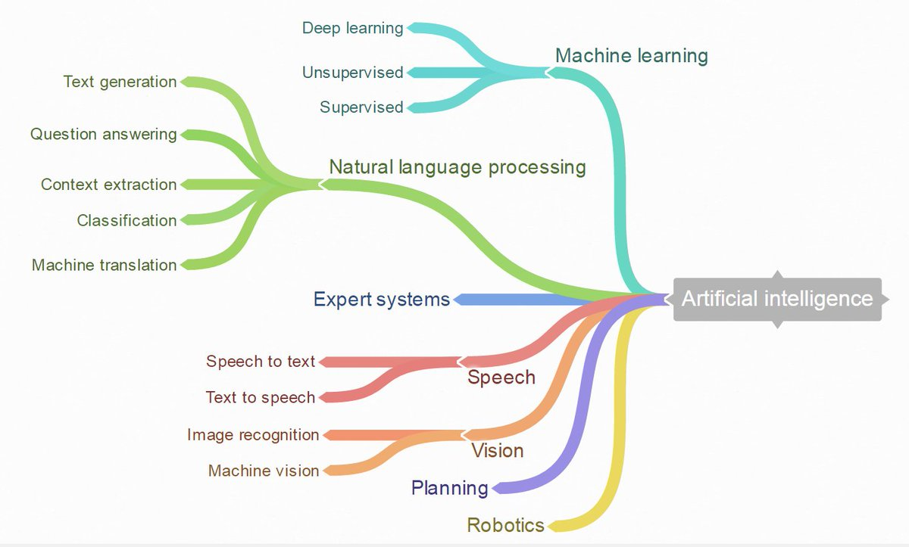

# What is Machine Learning

  This session comprises of a fairly basic introduction to Artificial Intelligence
  and its branches. This will be a hands on session to span multiple and we will be
  using python programming language. Thus, ensure that you have python interpreter
  and all libraries below are installed install.

# Supervised and Unsupervised Overview

# Overfitting and Underfitting

# Evaluating Model Performance

## Classification Error Metrics

## Regression Error Metrics
